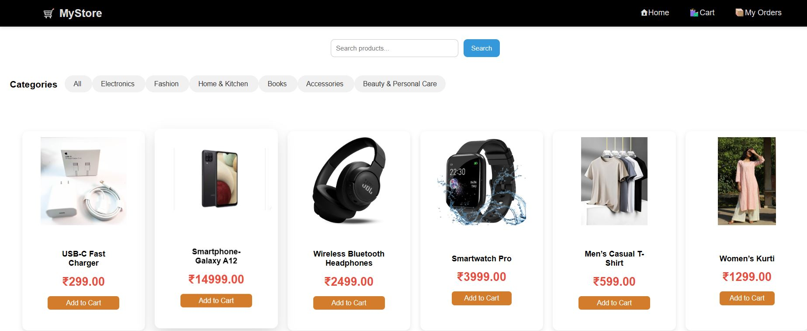
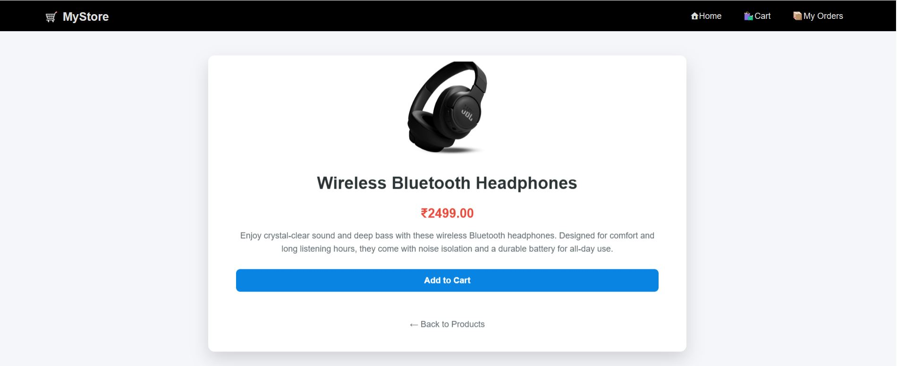
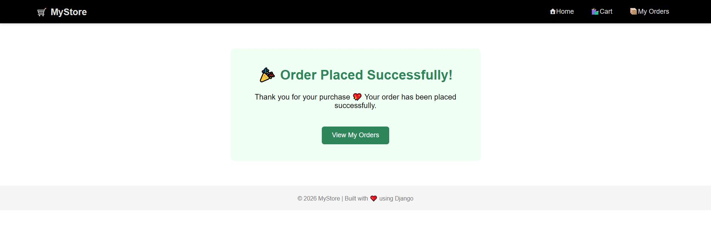
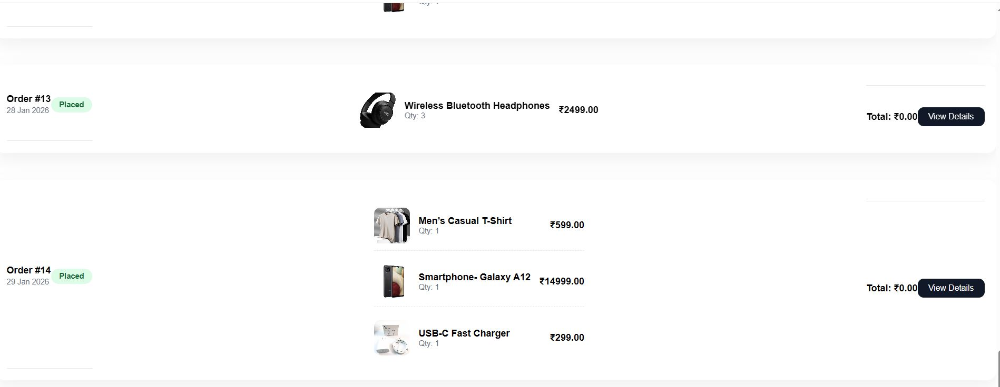
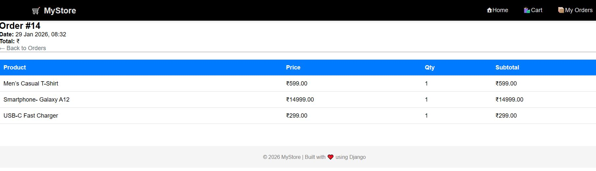

# 🛒 Django E-Commerce Website

A full-featured e-commerce web application built using Django.  
It allows users to browse products, filter by category, search products, add items to cart, and place orders with a clean and responsive UI.

---

## 🚀 Features

- Product listing with images
- Category-wise product filtering
- Search functionality
- Add to cart system
- Order placement
- Admin panel to manage products & categories
- Responsive and user-friendly UI

---

## 🖥️ Screenshots

### Home Page


### Product Page


### Cart Page


### Order Placed


### Order History


### Order History Detail


---

## ⚙️ Tech Stack

- Backend: Django (Python)
- Frontend: HTML, CSS, Bootstrap
- Database: SQLite
- Version Control: Git & GitHub

---

## 🛠️ Installation

1. Clone the repository:
```bash
git clone https://github.com/anamshaikh-dev/ecommerce-django.git